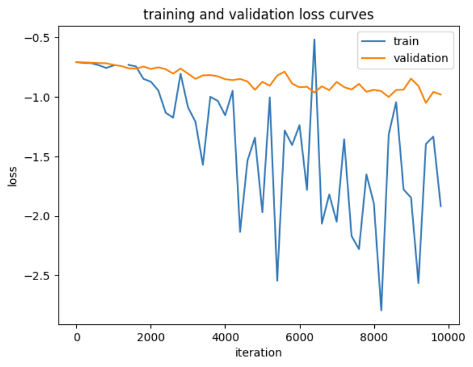
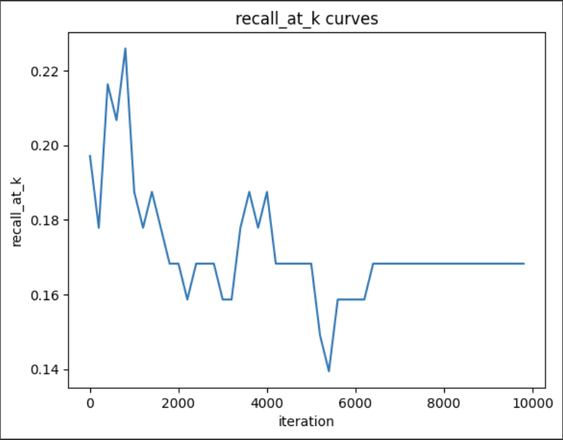

# Social Media Mining Final Project

## Setup
Before running the project. Please use terminal to run this code first:

```powershell
pip install -r requirements.txt
```

## Training
<H3>Things to Note Before Training:</h3> 

- If you want to use LightGCN, ```--model LightGCN``` , if you want to use NGCF then ```--model NGCF```
- The interaction choices are ```--interaction rating``` and ```--interaction review```
- The threshold (```--threshold```) is used to filter out the sentimental score, it is between <b> 2.5</b> to <b> 5 </b>. **The higher the result the smaller the data.** 
- The data path (```--data_path```) are for the data directory of the data that you want to train
1. LightGCN model with user rating as interaction
```powershell
    python3 train.py --model LightGCN --interaction rating --threshold 3.0 --data_path data/places_data_new.json
```
2. LightGCN model with user review sentiment score as interaction
```powershell
    python3 train.py --model LightGCN --interaction review --threshold 3.0 --data_path data/places_data_new.json
```

# Results

The results of the training would be as follow

Result of Training and Valdidation Loss


Result of Recall K Curves


Here are our result on the experiment
|                   |                                                |                                        |                                         |      |
|-------------------|------------------------------------------------|----------------------------------------|-----------------------------------------|------|
|                   |  <center>LightGCN with Rating Threshold (3.0) Filtering |  <center>LightGCN with Average Rating Filtering |  <center>LightGCN with Sentiment Score Filtering |  <center>NGCF |
|     test_loss     |                   <center> -20.1908<center>                    |                 <center>-20.55333               |                 <center> -1.03982                |      |
|   test_recall@20  |                      <center>0.1145                     |                  <center>0.11667                |                  <center>0.16827                 |      |
| test_precision@20 |                     <center> 0.00573                    |                  <center>0.00611                |                  <center>0.00865                 |      |
|    test_ndcg@20   |                      <center>0.04411                    |                 <center> 0.04501                |                  <center> 0.0726                 |      |